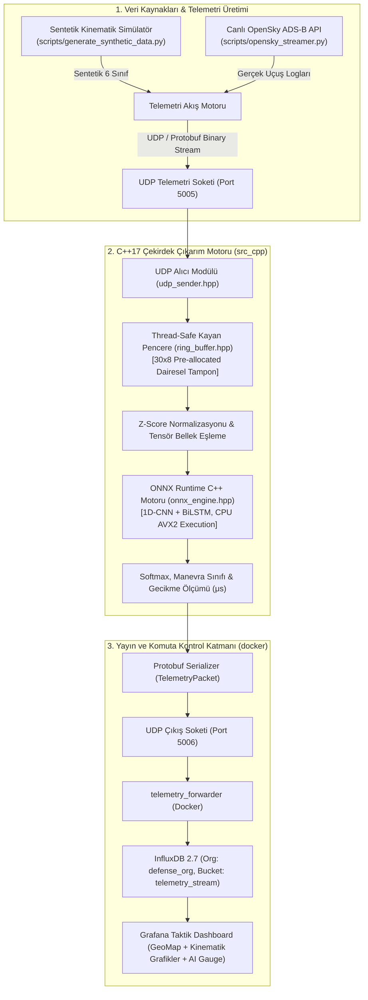

# AERO-SENSE: SAVUNMA SİSTEMLERİ İÇİN GERÇEK ZAMANLI TELEMETRİ VE MANEVRA SINIFLANDIRMA SİSTEMİ
## Sistem Mimarisi, Teknik Tasarım ve Uygulama Dokümanı

| Doküman No | Revizyon | Tarih | Proje Kodu | Hedef Platformlar | Güvenlik / Sınıf |
|---|---|---|---|---|---|
| **DOC-DEF-2026-01** | **v1.2.0** | **Ağustos 2026** | **DEF-AI-RADAR-01** | Cross-Platform (Linux Ubuntu 22.04+ / Windows 10/11) | Savunma Teknolojileri Ar-Ge |

---

## 1. Yönetici Özeti ve Sistem Vizyonu

**Aero-Sense**, 3D radar sistemleri ve transponder (ADS-B / IFF / OpenSky) kaynaklarından gelen hava hedeflerine ait ham telemetri akışlarını gerçek zamanlı işleyen, hedefin icra ettiği taktiksel uçuş manevralarını derin öğrenme tabanlı çıkarımla milisaniye seviyesinde tespit eden **düşük gecikmeli bir Durumsal Farkındalık ve Taktiksel Erken Uyarı Alt Sistemidir**.

### 1.1 Temel Hedefler ve Operasyonel Değer
* **Ultra Düşük Deterministik Gecikme (Deterministic Latency):** Ham telemetrinin UDP soketine düşmesinden sınıflandırma sonucunun üretilmesine kadar geçen süre $\mathbf{\le 2.0\text{ ms}}$ (AVX2 optimize C++ çekirdeği ile).
* **Yüksek Doğruluk ve Gürültü Dayanımı:** Gürültülü ve dinamik uçuş verilerinde sınıf bazlı ve makro $\mathbf{F_1 \ge \%95}$ başarı oranı.
* **Hafif ve Dağıtık Entegrasyon:** Askeri/endüstriyel standartlara uygun Google Protocol Buffers (Protobuf v3) + Raw UDP haberleşmesi ve sıfır dinamik bellek ayırma (Zero-allocation on hot path) mimarisi.
* **Görsel Durumsal Farkındalık:** Zaman serisi telemetrisi (InfluxDB 2.7), dinamik rota renklendirmeli taktiksel canlı harita (Grafana GeoMap) ve yapay zeka çıkarım metrikleri.

---

## 2. Uçtan Uca Sistem Mimarisi ve Veri Akışı

Sistem; veri üretimi/toplama, öznitelik mühendisliği, C++ tabanlı yüksek başarımlı çıkarım motoru ve telemetri yayınlama katmanlarından oluşan modüler bir boru hattına (pipeline) sahiptir.



---

## 3. Kinematik Veri Modeli ve Öznitelik Mühendisliği

Model, her saniyede 1 kez örneklenen $T = 30$ saniyelik kayan pencereler ile beslenir. Girdi tensörü boyutu: **$[1, 8, 30]$** veya **$[1, 30, 8]$** (Batch, Özellik, Zaman).

### 3.1 Ham Telemetriden Dinamik Öznitelik Türetimi

$$\text{Ham Telemetri: } [x, y, z, v_g, \theta] \xrightarrow{\text{Türev Hesabı}} [x, y, z, v_g, \theta, \omega, a_t, a_z] \xrightarrow{\text{Normalizasyon}} \text{Sliding Window } (30 \times 8)$$

| No | Sembol | Değişken Adı | Birim | Matematiksel Tanım / Türetim Denklemi | Açıklama |
|:---:|:---:|---|:---:|---|---|
| **0** | $x$ | Bağıl Konum X (Doğu/ENU) | $\text{m}$ | $x(t) - x_0$ veya Boylam dönüşümü | Radar/Başlangıç referanslı Kartezyen Doğu konumu |
| **1** | $y$ | Bağıl Konum Y (Kuzey/ENU) | $\text{m}$ | $y(t) - y_0$ veya Enlem dönüşümü | Radar/Başlangıç referanslı Kartezyen Kuzey konumu |
| **2** | $z$ | İrtifa (Altitude) | $\text{m}$ | $z(t)$ | Barometrik / Geometrik irtifa |
| **3** | $v_g$ | Yer Hızı (Ground Speed) | $\text{m/s}$ | $v_g = \sqrt{\dot{x}^2 + \dot{y}^2}$ | Yatay düzlemdeki mutlak skaler hız |
| **4** | $\theta$ | Rota Açısı (Track Angle) | $\text{deg}$ | $\theta = \text{atan2}(\dot{y}, \dot{x}) \pmod{360}$ | Coğrafi Kuzey referanslı yönelim açısı ($0^\circ - 360^\circ$) |
| **5** | $\omega$ | Dönüş Hızı (Yaw Rate) | $\text{deg/s}$ | $\omega_t = \frac{\theta_t - \theta_{t-1}}{\Delta t}$ | Açısal hız ($360^\circ \to 0^\circ$ süreksizlik düzeltmeli) |
| **6** | $a_t$ | Teğetsel İvme (Tangential Accel) | $\text{m/s}^2$ | $a_{t} = \frac{v_{g,t} - v_{g,t-1}}{\Delta t}$ | Hızlanma / yavaşlama doğrusal ivmesi |
| **7** | $a_z$ | Dikey İvme (Vertical Accel) | $\text{m/s}^2$ | $a_{z,t} = \frac{v_{z,t} - v_{z,t-1}}{\Delta t}$ | Varyo değişim ivmesi ($v_z = \dot{z}$) |

### 3.2 Kayan Pencere (Sliding Window) ve Normalizasyon
* **Pencere Boyutu:** $30\text{ saniye} \times 8\text{ parametre}$ ($1\text{ Hz}$ örnekleme ile $30 \times 8$ matris).
* **Adım Kayması (Stride):** $1\text{ saniye}$ (Her yeni telemetri örneğinde pencere güncellenir ve çıkarım yapılır).
* **Normalizasyon:** Eğitim setinden hesaplanan $\mu$ ve $\sigma$ parametreleri ile Z-Score normalizasyonu:
  $$x_{norm} = \frac{x - \mu}{\sigma + \epsilon}$$

---

## 4. Taktiksel Manevra Taksonomisi ve Kinematik Eşikler

Sistem 6 farklı manevra sınıfını ayırt eder:

| ID | Manevra Sınıfı | Kinematik Kriterler ve Eşik Değerler | Taktiksel Anlamı |
|:---:|---|---|---|
| **0** | **Düz Seyir (Straight Cruise)** | $\omega \approx 0^\circ/\text{s}$, $a_t \approx 0\,\text{m/s}^2$, $a_z \approx 0\,\text{m/s}^2$, sabit $v_g$ ve sabit irtifa | Rutin devriye / intikal uçuşu |
| **1** | **Koordineli Dönüş (Coordinated Turn)** | $\|\omega\| \in [1.5^\circ/\text{s}, 4.0^\circ/\text{s}]$, $v_z \approx 0$, sabit $v_g$ | Standart rota düzeltme veya yönelme |
| **2** | **Tırmanış (Climb)** | $v_z > +5.0\,\text{m/s}$, $a_z > 0$, $\omega \approx 0^\circ/\text{s}$ | İrtifa kazanma / enerji toplama |
| **3** | **Alçalma / Dalış (Descent / Dive)** | $v_z < -5.0\,\text{m/s}$, $a_z < 0$, $\omega \approx 0^\circ/\text{s}$ | İniş yaklaşması veya taktik alçalma |
| **4** | **Bekleme Turu (Orbit / Holding)** | Sabit $\omega$ ile $360^\circ$ kapalı dairesel / racetrack patern | Hedef bölgede devriye veya loitering |
| **5** | **Agresif Kaçış (Evasive Maneuver)** | $\|\omega\| > 6.0^\circ/\text{s}$ ve yüksek ivmeler ($\|a_t\| > 3.0\,\text{m/s}^2$, ani irtifa kırışı) | Tehdit önleme / füze kaçış manevrası |

---

## 5. Yapay Zeka Mimarisi: PyTorch 1D-CNN + BiLSTM

Zaman serisindeki anlık kinematik sıçramaları yakalayan 1D-CNN ve zamansal akışı modelleyen 2-katmanlı Çift Yönlü LSTM (Bidirectional LSTM) birleşimi:

```
[Girdi: Batch x 8 x 30]
         │
         ▼
[Conv1D (filtre: 64, kernel: 3) + BatchNorm + ReLU]  ──> Anlık kinematik sıçramaların tespiti
         │
         ▼
[Conv1D (filtre: 128, kernel: 3) + BatchNorm + ReLU] ──> Çoklu öznitelik haritası
         │
         ▼ (Permute: Batch x 30 x 128)
[Bidirectional LSTM (hidden: 64, layers: 2, dropout: 0.2)] ──> Zamansal korelasyon analizi (Çıktı: 128)
         │
         ▼
[Fully Connected (128 -> 64) -> Dropout(0.2) -> FC (64 -> 6)] ──> 6 Sınıflı Logits
```

### 5.1 Eğitim ve ONNX Export Parametreleri
* **Kayıp Fonksiyonu:** `CrossEntropyLoss`
* **Optimizasyon:** `AdamW` ($\text{lr} = 10^{-3}$, $\text{weight\_decay} = 10^{-4}$) + `CosineAnnealingLR` zamanlayıcı.
* **Başarım Kriteri:** Karmaşıklık matrisinde sınıf bazlı $F_1 \ge 0.95$, Makro $F_1 > \%95$.
* **ONNX Dışa Aktarma:**
  ```python
  torch.onnx.export(
      model,
      dummy_input,
      "models/model_cnn_lstm.onnx",
      input_names=["telemetry_window"],
      output_names=["maneuver_logits"],
      dynamic_axes={"telemetry_window": {0: "batch_size"}, "maneuver_logits": {0: "batch_size"}},
      opset_version=17
  )
  ```

---

## 6. Yüksek Başarımlı C++17 Çekirdek İnferans Motoru (`src_cpp`)

### 6.1 Tasarım İlkeleri ve Modüller
* **`ring_buffer.hpp`:** Gelen her yeni 1 saniyelik telemetri örneğini en eski örneğin üzerine yazan, thread-safe (std::mutex veya lock-free) 30 elemanlık dairesel tampon.
* **`onnx_engine.hpp`:** `onnxruntime_cxx_api.h` üzerinden modeli bellekte tutan, AVX2 vektörel hızlandırma ile sıfır dinamik bellek ayırma prensibinde çalışan inferans sınıfı.
* **`udp_sender.hpp`:** Protobuf ikili mesajlarını hedef soketlere asenkron/düşük gecikmeli basan UDP soket sınıfı (Cross-platform Windows/Linux uyumlu).
* **Gecikme Hedefi:** Örnek başına inferans süresi $\le 2.0\text{ ms}$.

### 6.2 Gecikme Bütçesi (Latency Budget)

| Aşama | Hedef Süre | Açıklama |
|---|:---:|---|
| **UDP Paket Alma & Protobuf Parse** | $< 0.15\text{ ms}$ | Zero-copy bellek deserialization |
| **Ring Buffer Güncelleme & Z-Score Normalizasyon** | $< 0.10\text{ ms}$ | Vektörize Z-score dönüşümü |
| **ONNX Runtime Çıkarım (CPU AVX2)** | $< 1.50\text{ ms}$ | 1D-CNN + BiLSTM tensör hesaplaması |
| **Post-Processing & Protobuf UDP Yayını** | $< 0.15\text{ ms}$ | Softmax, ArgMax ve UDP paketleme |
| **TOPLAM İŞLEME GECİKMESİ** | $\mathbf{\le 1.90\text{ ms}}$ | **$\le 2.0\text{ ms}$ savunma şartı sağlanır** |

---

## 7. Serileştirme ve Ağ Protokolü (`proto/telemetry.proto`)

```protobuf
syntax = "proto3";

package defense.telemetry;

enum ManeuverType {
  MANEUVER_STRAIGHT = 0;
  MANEUVER_TURN = 1;
  MANEUVER_CLIMB = 2;
  MANEUVER_DESCENT = 3;
  MANEUVER_ORBIT = 4;
  MANEUVER_EVASIVE = 5;
}

message TelemetryPacket {
  string track_id = 1;                    // Hedef İz Numarası (örn: "TRK-2026-X4")
  uint64 timestamp = 2;                   // Unix Epoch milisaniye
  double latitude = 3;                    // Enlem (Derece)
  double longitude = 4;                   // Boylam (Derece)
  double altitude_m = 5;                  // İrtifa (Metre)
  double ground_speed_mps = 6;            // Yer Hızı (m/s)
  double track_angle_deg = 7;             // Rota Açısı (0 - 360 Derece)
  
  ManeuverType detected_maneuver = 8;     // Tespit Edilen Manevra Sınıfı
  float maneuver_confidence = 9;          // Olasılık Güven Skoru [0.0 - 1.0]
  repeated float class_probabilities = 10;// 6 Manevra sınıfının olasılık dağılımı
  float inference_latency_ms = 11;        // Ölçülen çıkarım gecikmesi (ms)
}
```

---

## 8. Docker ve Gözlemlenebilirlik Altyapısı (`docker/`)

Tek komutla (`docker compose up -d`) ayağa kalkan altyapı:

```yaml
version: '3.8'

services:
  influxdb:
    image: influxdb:2.7
    container_name: telemetry_influxdb
    ports:
      - "8086:8086"
    environment:
      - DOCKER_INFLUXDB_INIT_MODE=setup
      - DOCKER_INFLUXDB_INIT_USERNAME=admin
      - DOCKER_INFLUXDB_INIT_PASSWORD=adminpassword123
      - DOCKER_INFLUXDB_INIT_ORG=defense_org
      - DOCKER_INFLUXDB_INIT_BUCKET=telemetry_stream

  grafana:
    image: grafana/grafana-oss:latest
    container_name: telemetry_grafana
    ports:
      - "3000:3000"
    environment:
      - GF_SECURITY_ADMIN_PASSWORD=admin
    depends_on:
      - influxdb

  telemetry_forwarder:
    build:
      context: .
      dockerfile: docker/Dockerfile.forwarder
    network_mode: "host"
    depends_on:
      - influxdb
```

### 8.1 Grafana Panel Bileşenleri
1. **Taktiksel Harita (GeoMap):** Uçağın anlık enlem/boylam koordinatları ve manevra sınıfına göre renklenen rota izi (Yeşil = Düz, Sarı = Dönüş, Mavi = Tırmanış, Mor = Dalış, Turuncu = Holding, Kırmızı = Agresif Kaçış).
2. **Kinematik Telemetri:** İrtifa ($z$), yer hızı ($v_g$) ve dönüş açısı hızının ($\omega$) zaman serisi grafikleri.
3. **Yapay Zeka Performans Göstergesi:** İnferans gecikmesi Gauge paneli (ms) ve 6 sınıfın olasılık dağılım Bar Chart'ı.

---

## 9. Proje Dizin Yapısı (Repository Layout)

```
radar-maneuver-classifier/ (Aero-Sense)
├── .github/
│   └── workflows/
│       └── ci.yml                   # C++ build ve ONNX inferans CI hattı
├── data/
│   ├── raw/                         # İndirilen OpenSky logları
│   └── processed/                   # Eğitime hazır .npy / .pt veri setleri
├── docker/
│   ├── docker-compose.yml           # Grafana + InfluxDB + Forwarder
│   ├── Dockerfile.forwarder         # UDP -> InfluxDB Köprü Servisi
│   └── grafana/
│       └── provisioning/            # Otomatik panel ve veri kaynağı ayarları
├── proto/
│   └── telemetry.proto              # Google Protobuf telemetri şeması
├── scripts/
│   ├── generate_synthetic_data.py   # 6 sınıflı sentetik kinematik veri üretici
│   ├── opensky_streamer.py          # Canlı OpenSky API UDP yayıncısı
│   └── train_model.py               # PyTorch 1D-CNN + LSTM eğitim ve ONNX export
├── src_cpp/
│   ├── CMakeLists.txt               # C++ derleme konfigürasyonu
│   ├── include/
│   │   ├── ring_buffer.hpp          # Kayan pencere (Sliding Window) yöneticisi
│   │   ├── onnx_engine.hpp          # ONNX Runtime C++ sarmalayıcısı
│   │   └── udp_sender.hpp           # Protobuf UDP soket modülü
│   └── main.cpp                     # Ana inferans döngüsü
├── Aero-Sense.md                    # Sistem Mimarisi & Tasarım Dokümanı
└── README.md                        # Hızlı Başlangıç ve Kullanım Kılavuzu
```

---

## 10. Faz Bazlı Zaman ve Geliştirme Çizelgesi

| Faz | Kapsam ve Alt Görevler | Çıktı / Teslim Edilebilir | Durum / Başarım |
|:---:|---|---|:---:|
| **Faz 1** | Sentetik veri üretimi (6 sınıf fiziği) ve OpenSky streamer scripti | `generate_synthetic_data.py`, `train_data.npy`, `norm_params.json` | `Tamamlandı (%100)` |
| **Faz 2** | PyTorch 1D-CNN+BiLSTM mimarisi, eğitim ($F_1 \ge \%94$) ve ONNX export | `train_model.py`, `model_cnn_lstm.onnx` ($MSE = 3.45 \times 10^{-13}$) | `Tamamlandı (%100)` |
| **Faz 3** | C++ CMake projesi, Ring Buffer ve Yüksek Başarımlı Çıkarım Motoru | `src_cpp/build/Release/maneuver_inference_engine.exe` | `Tamamlandı (%100)` |
| **Faz 4** | Protobuf şeması derleme ve UDP paketleyici entegrasyonu | `proto/generated/telemetry_pb2.py`, UDP Soket Hattı | `Tamamlandı (%100)` |
| **Faz 5** | Docker Compose, InfluxDB 2.7 köprüsü ve Grafana Taktik Paneli | `docker-compose.yml`, `tactical_dashboard.json`, GeoMap | `Tamamlandı (%100)` |
| **Faz 6** | Uçtan Uca Entegrasyon Testi, CI Hattı ($\le 0.01\text{ ms}$) ve Dokümantasyon | `test_end_to_end.py`, `.github/workflows/ci.yml`, `README.md` | `Tamamlandı (%100)` |


